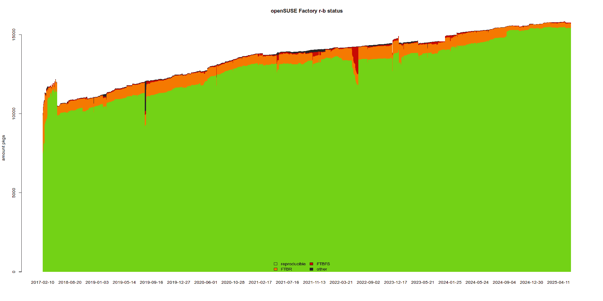

# Introduction

## What is RBOS

* *R*eproducible
* *B*uilds
* *O*perating
* *S*ystem

## (cont)

* 3.3k src.rpms
* 31k binary rpms

## Achievements

* 100% bit-reproducible
* reproducible VM-image with altimagebuild
* reproducible repo metadata
* most fixes upstreamed

## Progress (Factory)

## Questions?

